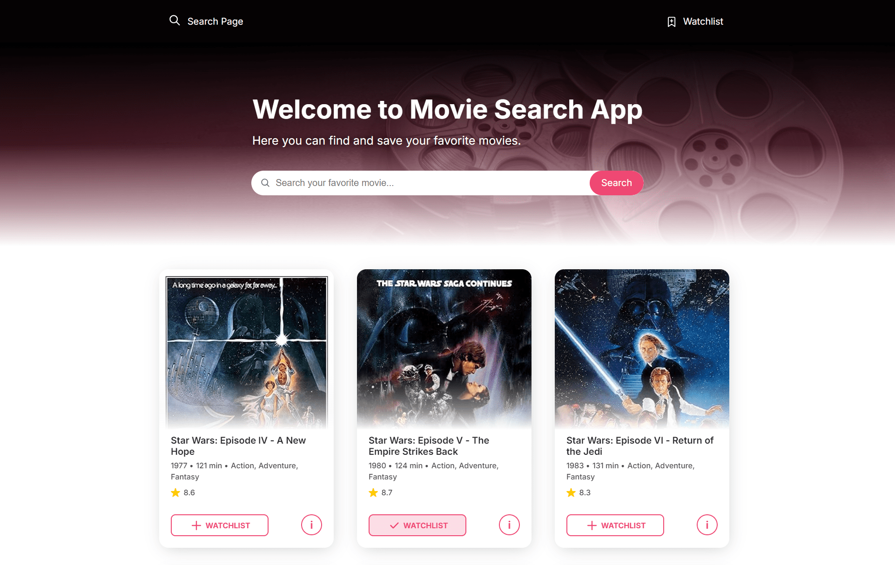

# Movie Watchlist 📽️

Movie Watchlist is a simple web application that allows users to search for movies and manage watchlist.
Users can search for movies by title, view detailed information about them, and add or remove them to or from their watchlist. 
The watchlist is stored in local storage, allowing users to manage it even after closing the browser.



## Table of Contents
- [Features](#features)
- [Technologies](#technologies)
- [Installation](#installation)
- [Usage](#usage)
- [Development](#development)
- [License](#license)

## Features
- Search movies by title using the OMDB API.
- View detailed information about selected movies.
- Add movies to a watchlist.
- View and manage the watchlist stored in local storage.
- Remove individual movies or clear the entire watchlist.

## Technologies
- HTML
- SCSS
- JavaScript
- Handlebars
- Vite

## Installation 
1. Clone the repository:
```sh
  git clone https://github.com/daniela-ghenu/movie-watchlist.git
``` 
2. Navigate to the project directory:
```sh
  cd movie-watchlist
```
3. Install the dependencies:
```sh
  npm install
```   

## Usage
- Start the development server:
```sh
  npm run dev
```
- Build the project for production:
```sh
  npm run build
```
- Preview the production build:
```sh
  npm run preview
```
## License
This project is licensed under the MIT License.
